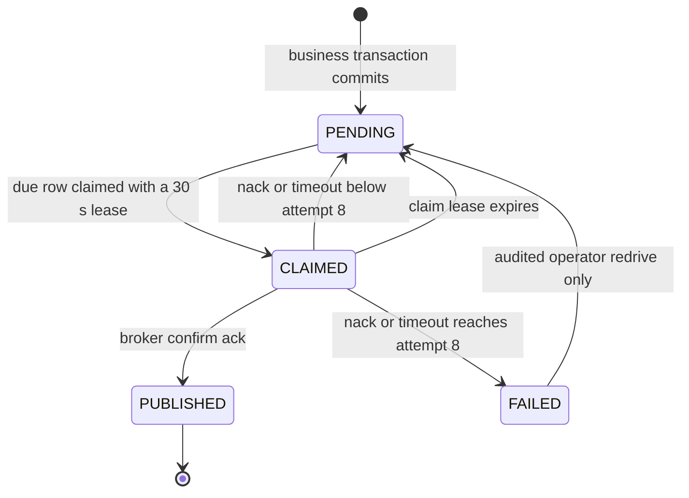

# Transactional Outbox Design

Status: normative Phase 2 design for `FEAT-PLAT-004`.

Sources: ratified architecture v1.4 sections 9.2, 11.2-11.4, 14.4,
14.6, 16.2-16.4, 17.1, 19.8, and 23.7; `ADR-009`; `ADR-023`;
`ARC-PLAT-006`; `ARC-PLAT-011`; `ARC-DATA-018`; `ARC-DATA-026`;
`ARC-REL-004`; and the approved `FEAT-PLAT-004` Phase 0 records.

This document fixes the contracts that Phases 3 and 4 implement. It does not
claim that the table, roles, relay, broker topology, or conformance gates
already exist.

## P2.1 Outbox Event Table

`outbox.outbox_event` is a weekly range-partitioned table on `created_at`. The
logical row identity is the application-generated UUIDv7 `outbox_event_id`.
PostgreSQL requires a unique key on a partitioned table to include its
partition key, so the physical primary key is
`(created_at, outbox_event_id)`. No foreign key points at an outbox row. The
UUIDv7 generator is the global identity source, and consumers persist
`outbox_event_id` alone as their delivery guard.

| Column | Type and constraints | Purpose and authority |
|---|---|---|
| `outbox_event_id` | `uuid NOT NULL` | Stable message identity from `OutboxEventId`; drives redelivery deduplication required by `NFR-REL-003` and section 14.6. |
| `tenant_id` | `uuid NOT NULL` | Tenant scope for forced RLS under `ARC-DATA-018`; copied from the caller's typed `TenantId`, never from payload JSON. |
| `aggregate_type` | `varchar(128) NOT NULL` | Stable aggregate kind from `AggregateReference`; keeps `aggregate_id` meaningful without inspecting payload. |
| `aggregate_id` | `text NOT NULL` | Stable partition/business reference required by section 11.2 and useful for version guards; it is not an ordering guarantee. |
| `event_type` | `text NOT NULL` | Registered `<context>.<Event>.v<n>` contract name required by `ARC-PLAT-012`; a check constraint enforces the lexical form. |
| `payload` | `jsonb NOT NULL` | Schema-validated integration event. P2.9 forbids credential material and unnecessary personal data before insertion. |
| `correlation_id` | `varchar(26) NOT NULL` | Canonical ULID required by `NFR-OBS-002` to join the originating request to asynchronous work. |
| `traceparent` | `varchar(55) NULL` | Valid W3C `traceparent` carrier for section 16.3. It is absent only when no sampled trace exists. |
| `tracestate` | `text NULL` | Optional W3C vendor trace state; size is bounded to 512 characters and no baggage is stored. |
| `state` | `varchar(16) NOT NULL DEFAULT 'PENDING'` | Closed state set `PENDING`, `CLAIMED`, `PUBLISHED`, `FAILED` for the section 11.2 relay lifecycle. |
| `attempt_count` | `smallint NOT NULL DEFAULT 0` | Counts failed publication attempts; constrained to `0..8` for the poison threshold. |
| `next_attempt_at` | `timestamptz NOT NULL` | Makes the bounded retry delay durable across worker restarts and lets the claim query select only due work (`ARC-REL-004`). Initially equal to `created_at`. |
| `claim_expires_at` | `timestamptz NULL` | Thirty-second lease boundary required to reclaim work after a relay crash. |
| `claimed_by` | `text NULL` | Bounded worker-instance identifier used for diagnosis and guarded state updates; never a hostname supplied by a request. |
| `occurred_at` | `timestamptz NOT NULL` | Controlled-clock business occurrence time from `OutboxMessage`; distinct from persistence order. |
| `created_at` | `timestamptz NOT NULL` | Database insertion time, partition key, and oldest-first relay order. |
| `published_at` | `timestamptz NULL` | Publisher-confirm completion time; non-null only in `PUBLISHED`. |
| `last_error` | `varchar(64) NULL` | Allowlisted failure category only, such as `BROKER_NACK` or `CONFIRM_TIMEOUT`; payloads, broker text, SQL, and driver messages are forbidden. |

Database checks enforce the state-dependent shape: only `CLAIMED` has both
claim fields; only `PUBLISHED` has `published_at`; `PENDING` and `FAILED` have
no claim fields; and `FAILED` has `attempt_count = 8` plus a non-null
`last_error`. `created_at`, `occurred_at`, and all comparisons use UTC
instants. Mutable relay columns are never part of the published message.

Indexes are partition-local and lead with the predicates they serve:

```text
(created_at, outbox_event_id)                         primary key
(state, created_at, outbox_event_id)                   WHERE state = 'PENDING'
(state, claim_expires_at)                              WHERE state = 'CLAIMED'
(tenant_id, aggregate_id, created_at)                  operator lookup
```

The writer accepts typed metadata and a registered event value, not arbitrary
column maps. Payload validation and P2.9 classification run before `INSERT`,
so credential-bearing JSON cannot become a committed outbox row. The writer
joins the caller-owned transaction and exposes no connection-supplying API,
preserving `ARC-PLAT-011` atomicity.

## P2.2 Relay State Machine



| From | To | Guard and mutation | Authority |
|---|---|---|---|
| none | `PENDING` | The caller's business transaction inserts a valid event with attempt zero and `next_attempt_at = created_at`; rollback creates neither business state nor row. | `OutboxWriter` only |
| `PENDING` | `CLAIMED` | `next_attempt_at <= now()`; the row is selected by P2.5, `claimed_by` is set, and `claim_expires_at = now() + 30 seconds`. | Relay |
| `CLAIMED` | `PUBLISHED` | A publisher confirm ack was received for this event and the update still matches its `claimed_by`; set `published_at` and clear claim/error fields. | Relay |
| `CLAIMED` | `PENDING` | A nack or confirm timeout increments the failed-attempt count to less than 8; set durable jittered `next_attempt_at` and clear claim fields. | Relay |
| `CLAIMED` | `PENDING` | `claim_expires_at < now()`; clear the abandoned claim without incrementing publication attempts and increment the reclamation metric. | Reclamation sweep |
| `CLAIMED` | `FAILED` | A nack or timeout increments the failed-attempt count to exactly 8; clear claim fields and retain only an allowlisted `last_error`. | Relay |
| `FAILED` | `PENDING` | P2.15 authorizes an operator, requires a reason, records the audit event atomically, and resets retry metadata. | Operator redrive |

Every update includes the expected current state. Claim-owner updates also
match `claimed_by`, making a stale worker's late confirm unable to overwrite a
reclaimed row. A zero-row update is treated as lost ownership, never as
success. `PUBLISHED` has no relay transition. `FAILED` is terminal for all
automatic relay and reclamation work; only the audited redrive command may
leave it. Published rows are removed only by P2.11 retention, not by a state
transition.

## P2.3 Relay Role

`TASK-PLAT4-DEFECT-001` is resolved locally by the `NOLOGIN`, non-owner role
`app_outbox_relay`. Its complete positive grant set is:

```sql
GRANT USAGE ON SCHEMA outbox TO app_outbox_relay;
GRANT SELECT, UPDATE ON TABLE outbox.outbox_event TO app_outbox_relay;
GRANT app_outbox_relay TO app_worker;
```

The grant applies to the partitioned parent and every partition through
PostgreSQL parent-table access. `app_outbox_relay` receives no `INSERT`,
`DELETE`, `TRUNCATE`, `REFERENCES`, `TRIGGER`, sequence, function, ownership,
role-administration, or `BYPASSRLS` privilege. It receives no privilege in a
module, `audit`, or `platform` schema. In particular, it cannot write any
business table.

`app_worker` is the only member. `app_api`, `app_pindist`, module roles,
composite roles, and operations roles never receive direct or inherited
membership. Pool login roles retain `ARC-DATA-026`'s no-direct-object-grants
invariant: a worker must begin a transaction and assume this role through the
security-context initializer before any relay SQL can succeed.

The executable grant matrix is the eventual single source for the role,
membership, grants, and explicit denials. Its catalogue gate must compare
effective privileges as well as direct ACLs, reject any extra membership or
object privilege, and prove negative access against a representative table in
every other schema. The approved amendment and baseline correction remain
tracked in `docs/defects/TASK-PLAT4-DEFECT-001.md`; this design does not widen
that approval.

## P2.4 Forced RLS Policies

The partitioned parent has RLS enabled and forced. Partitions are inaccessible
directly to runtime roles; all access goes through the parent.

```sql
ALTER TABLE outbox.outbox_event ENABLE ROW LEVEL SECURITY;
ALTER TABLE outbox.outbox_event FORCE ROW LEVEL SECURITY;

CREATE POLICY tenant_outbox_write ON outbox.outbox_event
    AS PERMISSIVE
    FOR ALL
    TO app_tenancy, app_iam, app_academic, app_people,
       app_questionbank, app_authoring, app_examaccess, app_delivery,
       app_grading, app_result, app_correction, app_notification,
       app_txn_examentry
    USING (
        tenant_id = current_setting('app.tenant_id', false)::uuid
    )
    WITH CHECK (
        tenant_id = current_setting('app.tenant_id', false)::uuid
    );

CREATE POLICY outbox_relay_drain ON outbox.outbox_event
    AS PERMISSIVE
    FOR ALL
    TO app_outbox_relay
    USING (
        current_user = 'app_outbox_relay'
        AND current_setting('app.platform_scope', false) = 'outbox_relay'
    )
    WITH CHECK (
        current_user = 'app_outbox_relay'
        AND current_setting('app.platform_scope', false) = 'outbox_relay'
    );
```

The first policy preserves `ARC-DATA-018` on the write path. Module and
composite roles retain only `INSERT`, so they cannot read any outbox row; if a
future grant accidentally adds `SELECT`, the strict tenant predicate still
prevents reading another tenant's row. The writer does not use `RETURNING`,
which would require a read grant.

The second policy resolves the cross-tenant drain conflict from
`TASK-PLAT4-DEFECT-003` without `BYPASSRLS`, owner access, a wildcard tenant,
or `row_security = off`. Every relay transaction begins with exactly these
statements, issued by the existing security-context initialization seam:

```sql
SET LOCAL ROLE app_outbox_relay;
SET LOCAL app.platform_scope = 'outbox_relay';
```

`outbox_relay` is a closed sentinel platform context, not a tenant UUID and
not caller-controlled input. Both policies use strict
`current_setting(..., false)`: missing context raises instead of widening
access. Role and platform context are reset on commit, rollback, cancellation,
timeout, and release under R9. Catalogue tests require exactly these two
policies, their role sets, forced RLS, and negative module/relay access cases.

## P2.5 Claim Query

Section 11.2's claim operation is expressed as a data-modifying CTE because
PostgreSQL does not permit `ORDER BY`, `FOR UPDATE SKIP LOCKED`, and `LIMIT`
directly on `UPDATE`. The following is its executable, normative form:

```sql
WITH claimable AS MATERIALIZED (
    SELECT created_at, outbox_event_id
    FROM outbox.outbox_event
    WHERE state = 'PENDING'
      AND next_attempt_at <= now()
    ORDER BY created_at, outbox_event_id
    FOR UPDATE SKIP LOCKED
    LIMIT :batch_size
)
UPDATE outbox.outbox_event AS event
SET state = 'CLAIMED',
    claim_expires_at = now() + interval '30 seconds',
    claimed_by = :relay_instance
FROM claimable
WHERE event.created_at = claimable.created_at
  AND event.outbox_event_id = claimable.outbox_event_id
  AND event.state = 'PENDING'
RETURNING event.*;
```

`:batch_size` is the P2.13 validated value and `:relay_instance` is a bounded
runtime identity. The query runs after the P2.4 context statements in one
short transaction and commits before broker I/O. It claims only due work and
selects the oldest unlocked rows first; UUIDv7 identity is the deterministic
tie-breaker. Because SQL does not guarantee `RETURNING` order, the adapter
sorts the returned records by `(created_at, outbox_event_id)` before P2.6.

Row locks make each selected set exclusive until the claim commits.
`SKIP LOCKED` means another relay neither waits nor selects those rows, so two
concurrent executions return disjoint batches. The second execution may pass
a locked oldest row, but no row is lost: its claim is committed or reclaimed
after 30 seconds. An empty result is a normal idle tick, not a failure.

## P2.6 Sequential Publish Algorithm

The relay processes the P2.5 result in its sorted order with `concatMap`
concurrency one. It never publishes a whole batch concurrently and never
holds a database connection while waiting for the broker.

1. Publish one persistent RabbitMQ message to the durable `integration`
   exchange. Use `outbox_event_id` as the message id, `event_type` as the type
   and routing key, `aggregate_id` as the partition-key header, and carry only
   the P2.1 correlation and W3C trace headers. The publish is mandatory and has
   a bounded five-second confirm timeout.
2. On publisher-confirm ack, open a short relay-context transaction and update
   `CLAIMED` to `PUBLISHED`, matching both identity and `claimed_by`. Set
   `published_at = now()` and clear claim and error fields. Only this ack path
   can mark a row published.
3. On nack, unroutable return, or confirm timeout, open a short transaction,
   lock the still-owned claim, and increment `attempt_count` exactly once. For
   attempts 1 through 7, return it to `PENDING`, clear claim fields, write an
   allowlisted `last_error`, and set `next_attempt_at` using full jitter over
   `0..min(30 seconds, 200 ms * 2^(attempt_count - 1))`. At attempt 8, move it
   to `FAILED`, clear claim fields, and emit the failure metric that drives the
   operator alert.
4. After a failed publication, release every not-yet-published row owned by
   this batch from `CLAIMED` to `PENDING` without incrementing its attempt
   count, then end the batch. Earlier confirmed rows remain `PUBLISHED`; the
   failed row observes its durable retry time; untouched rows are immediately
   eligible. The next tick again starts with the oldest due row.

The backoff is scheduled through `next_attempt_at`; the reactive chain never
sleeps or blocks an event-loop thread. A broker that never acknowledges a
message can therefore produce only `PENDING` retries and ultimately `FAILED`,
never `PUBLISHED`. If the broker accepted a message but the confirm or state
update was lost, claim expiry can publish it again. That is the intentional
at-least-once boundary, absorbed by P2.8 rather than disguised as exactly
once. Failure logs and `last_error` use the fixed category, event id, attempt,
and correlation id only; broker/driver text and payload are excluded.

## P2.8 Consumer Dedupe Primitive

Each consuming module creates `<module>.processed_event` in its own schema:

```sql
CREATE TABLE <module>.processed_event (
    outbox_event_id uuid PRIMARY KEY,
    tenant_id uuid NOT NULL,
    event_type text NOT NULL,
    processed_at timestamptz NOT NULL,
    outcome varchar(24) NOT NULL
        CHECK (outcome IN ('APPLIED', 'BUSINESS_DUPLICATE', 'STALE_VERSION'))
);
```

The table is unpartitioned so the primary key enforces uniqueness on
`outbox_event_id` alone. It receives the standard enabled-and-forced tenant
RLS policy and is owned and granted exactly like the module's business tables.
Schema selection comes from a closed consumer registration, never a message or
request string.

The reusable consumer transaction proceeds as follows:

1. `INSERT ... ON CONFLICT (outbox_event_id) DO NOTHING RETURNING` reserves
   this delivery under the consumer's module role and tenant context. No
   returned row means the event already committed and the handler returns the
   duplicate no-op result.
2. The consumer applies its operation through SQL guarded by the exact section
   14.6 business key from `contracts/idempotency-inventory.yaml`. A conflict or
   failed state/version predicate is a no-op, and updates the reserved row's
   outcome to `BUSINESS_DUPLICATE` or `STALE_VERSION`.
3. The business effect, aggregate-version guard, and `processed_event` row
   commit in the same transaction. Only then may the broker delivery be
   acknowledged. Rollback removes both reservation and effect.

The second guard remains in the owning business store because its semantics
vary by operation: for example `(result_id, version_number)` differs from an
attempt terminal-state guard. The generic event-id guard cannot replace it,
and a new event id for the same business operation must still be harmless.

The guard cannot live in `outbox`: module roles intentionally have no
`SELECT` there, sharing it would violate schema ownership, and it would couple
consumer availability to relay privileges. An in-memory guard is invalid
because it disappears on restart, is not shared by replicas, and cannot commit
atomically with the effect.

## P2.9 Payload Minimisation Rule

The event-schema checker enforces the following rules over every schema below
`contracts/events/`; they are build conditions, not author guidance:

1. Every object sets `additionalProperties: false`. Every reachable property,
   including properties under `$defs` and composed schemas, is inspected.
2. The root declares a non-empty `x-consumers` array of stable consuming
   context names. Every leaf declares a non-empty `x-required-by` array that
   is a subset of those consumers. A field with no named consumer fails.
3. Every leaf declares exactly one `x-data-classification` value from
   `identifier`, `operational`, or `personal`. No credential classification
   exists. Fields classified `personal` additionally require a non-empty
   `x-identifier-insufficient-reason`; omission means an identifier must be
   used instead of the value.
4. The shared `SecretFieldPattern` scans every property path
   case-insensitively. A segment equal to `pin`, `otp`, `token`, `secret`,
   `password`, `key`, or `authorization` fails the schema. Aliases,
   encrypted values, hashes, and references that carry the same credential
   semantics are also forbidden by the required classification review.
5. `default`, `examples`, and `const` values are forbidden on `personal` and
   `identifier` fields, and unrestricted free-form payload objects are
   forbidden. Payload size is bounded by the registered schema.

The checker emits the schema path and rule id but never an instance value.
The writer validates the serialized payload against the passing registered
schema before inserting it. An undeclared property, credential-shaped field,
unowned field, or unjustified personal value therefore cannot commit. Event
owners must carry only identifiers unless the schema records why a named
consumer cannot perform its work from an identifier.

## P2.11 Retention And Partition Maintenance

`outbox.outbox_event` uses UTC-aligned weekly range partitions on
`created_at`, chosen over monthly partitions to bound retained volume while
keeping partition DDL infrequent. The migration creates the current and next
two partitions; a daily maintenance tick attaches the next missing weekly
partition before it is needed.

A partition is eligible to detach only when all of these guards hold under an
advisory lock:

- its exclusive upper `created_at` bound is older than seven days;
- every row is `PUBLISHED`;
- every `published_at` is at least seven days old; and
- no row is `PENDING`, `CLAIMED`, or `FAILED`.

Thus retention is age-driven, never tied to a release. An unresolved `FAILED`
row prevents its whole partition from detaching, as does delayed or in-flight
work. The maintenance metric exposes blocked partitions for operator action.
Detached data is no longer part of the live outbox; its corresponding
immutable audit record is the durable evidence under section 11.2. The outbox
is transport state and is not retained as an audit substitute.

`TASK-PLAT4-DEFECT-002` is resolved with a `NOLOGIN`, non-owner role
`app_outbox_maintenance`. It has `USAGE` on `outbox` only so it can resolve
approved routine names, but no row-data privileges and no `ALTER`. It receives
`EXECUTE` on exactly two owner-controlled `SECURITY DEFINER` routines:

```text
outbox.attach_week_partition(partition_start date)
outbox.detach_expired_partition(partition_name name)
```

The routines are owned by `app_migrator`, set a fixed safe `search_path`,
fully qualify every relation, derive or validate the partition name, reject an
overlapping/non-weekly bound, verify `pg_inherits`, acquire the maintenance
lock, and enforce the eligibility guards internally. They accept no SQL or
arbitrary relation identifier. `app_worker` alone receives membership in
`app_outbox_maintenance`; `app_api` and `app_pindist` do not.

The caller records an audit event with the partition bounds, action, actor,
reason, and outcome; it never copies payload data into audit. Negative tests
prove the role cannot read an outbox payload, attach or detach a foreign
relation, bypass an age/state guard, or invoke an unapproved owner function.

## P2.12 Integration Topology

The feature declares only the generic integration substrate identified in
Phase 1. Grading and notification queues remain owned by their business
features.

| Entity | Durable definition | Routing and consumption |
|---|---|---|
| `integration` | Durable topic exchange, not auto-deleted | The relay publishes with `<context>.<Event>.v<n>` as the routing key and requires publisher confirms plus mandatory routing. |
| `integration.<context>` | Durable quorum queue with dead-letter exchange `integration.dlx` | Bound to `integration` by `<context>.#`; one version-aware context consumer uses manual acknowledgement and prefetch 32. |
| `integration.dlx` | Durable topic exchange, not auto-deleted | Receives explicit dead-letter publications and broker dead-letter fallbacks. |
| `integration.dlq` | Durable quorum queue, not auto-deleted | Bound to `integration.dlx` by `#`; no consumer silently drains it. Operator inspection/redrive is P2.15. |

Prefetch 32 bounds unacknowledged deliveries; it does not promise concurrency
or ordering. Queue declaration is idempotent and fails startup on an
inequivalent existing definition. Every context queue uses the same quorum,
durability, acknowledgement, and dead-letter arguments.

The consumer dead-letter adapter republishes the original immutable envelope
to `integration.dlx` with publisher confirms before acknowledging the source
delivery. If that confirm fails, it nacks and requeues the source. The DLQ copy
adds bounded headers for original exchange, routing key, queue, dead-letter
time, and exactly one closed reason:

| Reason | Meaning | Alert |
|---|---|---|
| `UNHANDLED_EVENT_VERSION` | The event type is well-formed and registered, but the target consumer did not declare that version. | Compatibility/deployment alert keyed by context and event type. |
| `POISON_PAYLOAD` | The declared version cannot be decoded/validated or repeatedly fails a non-transient consumer check. | Poison-message alert keyed by context and failure category. |

Reason is present in both the `x-platform-dead-letter-reason` header and the
DLX routing key, so DLQ queries, metrics, and alerts can distinguish the two
without reading payloads. Exception text, stack traces, credentials, and
personal data never enter headers or metric labels. A crash after confirmed
DLQ publish but before source acknowledgement can duplicate the DLQ record;
the stable `outbox_event_id` keeps redrive and consumption idempotent.

## P2.13 Runtime Configuration

The relay reads one revision-consistent snapshot from
`platform.platform_config`. Phase 3 seeds these typed rows:

| Key | Type | Default | Inclusive bounds | Takes effect |
|---|---|---:|---:|---|
| `outbox.relay.batch-size` | integer | `200` | `1..1000` | Next claim |
| `outbox.relay.tick-interval-ms` | integer | `200` | `50..5000` | Next scheduled tick |

The upper batch bound prevents one relay from monopolizing the worker pool or
holding an unbounded claim set. The interval bounds prevent a database polling
storm and prevent configuration from silently disabling the relay. They are
closed constants in the loader and cannot themselves be changed as data.

At startup, a missing row, duplicate key, wrong type, mixed revision, or value
outside its bounds raises `OUTBOX_CONFIG_INVALID` and fails application boot;
values are never clamped. This is the `ARC-VERIFY-018` startup behavior. At
runtime, the loader polls the revision without restarting the process, reads a
changed snapshot in one transaction, validates both values, and atomically
swaps the immutable configuration only when the whole snapshot passes. An
invalid reload is rejected with the named metric/error and the previous valid
snapshot stays in force, matching P4.7.

Batch size is read once per claim and tick interval once per reschedule, so a
valid database update changes behavior without a deploy and cannot mutate an
in-flight batch. Configuration writes remain an authorized, audited platform
operation; the relay has read access only through a narrow configuration query
port and never accepts these values from an event or request.

## P2.14 Conformance Rules

The Phase 4 gate extends the existing R7 ArchUnit suite with two named rules.
Both inspect compiled production classes and have deliberate failing fixtures.

### Asynchronous Propagation Is Outbox-Only

`R7_OUTBOX_ONLY_ASYNC_PROPAGATION` enforces all of the following:

- direct RabbitMQ, AMQP, Kafka, and broker-publisher dependencies are confined
  to `org.meldtech.platform.platform.infra.outbox..`;
- an `OutboxWriter` implementation is confined to that adapter package, while
  feature slices consume only the shared-kernel port;
- a slice constructing or depending on an `IntegrationEvent` must depend on
  `OutboxWriter`, and cannot depend on a broker adapter;
- a caller of `CrossModuleCommandApi` must carry `@SynchronousAtomicFlow` and
  name a value in the closed `AtomicCrossModuleFlow` enumeration; and
- the enumerated call must use `TransactionalCollaboration`; no second direct
  cross-schema mechanism or unannotated exception is accepted.

One integration assertion queries `pg_roles`, `pg_auth_members`, and object
ACLs. The set of `app_txn_%` roles must equal the composite roles named by
`AtomicCrossModuleFlow`; membership and effective grants must equal the
executable grant matrix, with no extra schema/table privilege. This is the
database limb of `ARC-VERIFY-006`; the existing `FEAT-PLAT-001` P4.24 rule
remains its static foundation.

### Answer Acceptance Emits No Integration Event

`ARC_PLAT_006_ANSWER_PATH_HAS_NO_OUTBOX` identifies the delivered answer
handler through its stable slice descriptor and requires exactly one matching
slice. An ArchUnit condition rejects any class in that slice that depends on
`OutboxWriter`, an `IntegrationEvent` implementation, an outbox adapter, or a
broker client, and rejects any method call to `OutboxWriter.append`. Its
constant-pool SQL condition also rejects `outbox.outbox_event` from the
slice-local `Queries` class, so moving the insert behind a query helper does
not evade the rule. `AnswerSubmitted`, if used inside the aggregate, remains a
domain event and must not implement `IntegrationEvent`.

The failure text names `ADR-009` and `ARC-PLAT-006`: answer acceptance is the
deliberately event-free hot path, not a missing publication. The rule does not
weaken R8; required audit emission remains in the business transaction.

## P2.15 Audited Operator Redrive

Redrive is an application command exposed through the future `FEAT-OPS-002`
operator surface, never a public route on the outbox adapter. Authorization is
deny-by-default and requires an authenticated workforce operator with the
specific recovery permission. Actor and correlation id come from trusted
context; the request supplies a non-blank bounded reason and an idempotent
`redrive_request_id`. Payload editing is not a redrive operation.

Every outcome emits an audit event containing request id, actor, reason,
source kind, `outbox_event_id`, event type, target context, correlation id,
and outcome. Payload, broker exception text, and personal data are excluded.
A repeated request id returns the recorded outcome without performing another
redrive.

### Failed Outbox Row

The command locks the named row and requires `state = 'FAILED'`. It verifies
the schema is still registered and the target consumers declare the version.
In the same authorized operation that records the audit event, it changes the
row to `PENDING`, resets `attempt_count` to zero, sets `next_attempt_at = now()`,
and clears claim, publication, and error fields. A non-`FAILED` row is a
recorded no-op; a `PUBLISHED` row can never be requeued through this command.

The event keeps its original `outbox_event_id`, payload, event type,
correlation id, and trace context. This matters because a confirm may have
been lost after the broker and consumer succeeded. On delivery, every target
consumer must run the P2.8 event-id reservation and its own section 14.6
business guard again before applying an effect. A partial prior success is
therefore acknowledged as `BUSINESS_DUPLICATE`, not repeated.

### Dead-Lettered Message

The command requires a DLQ message with a recognized closed reason and intact
original routing metadata. `UNHANDLED_EVENT_VERSION` can be redriven only
after that consumer declares the version; `POISON_PAYLOAD` can be redriven
only when the unchanged payload validates against its registered schema and
the named failure is known to be resolved. A payload requiring correction is
replaced by a new owning-feature event, never edited in the DLQ.

Redrive republishes the original envelope and `outbox_event_id` to its original
exchange/routing key, adding only request id, actor id, reason code, and
redrive count headers. It publisher-confirms the new message before
acknowledging the DLQ delivery. A crash between those steps may republish it,
which is safe only because the normal consumer dispatcher re-checks both
durable guards in its transaction. If either guard already exists, the
consumer performs no effect and the audit outcome records the no-op.
